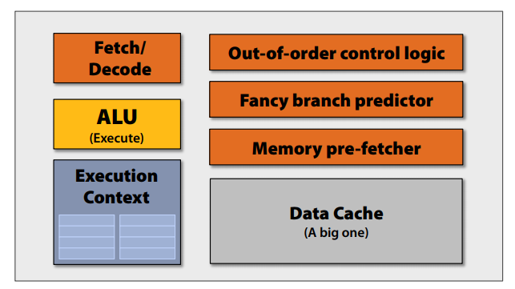
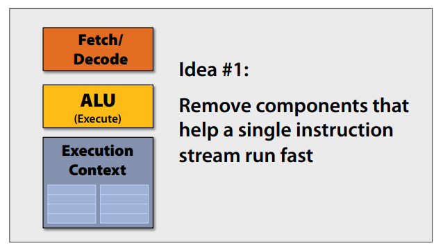
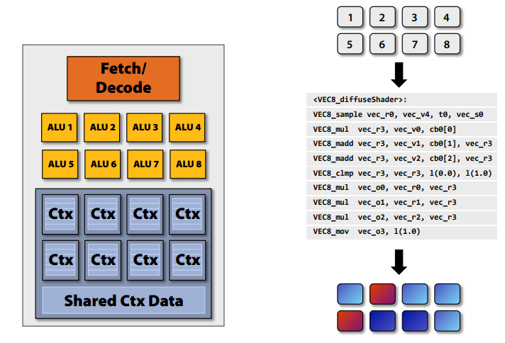
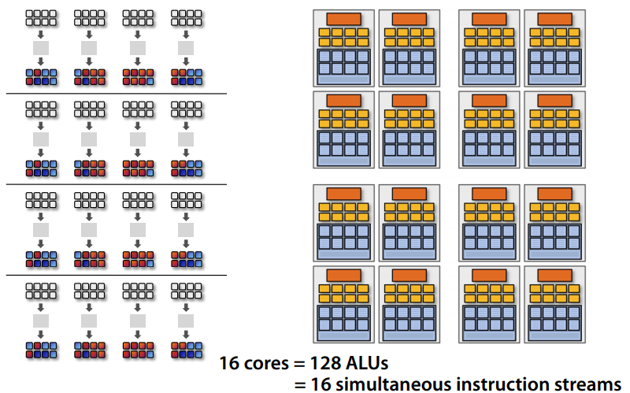
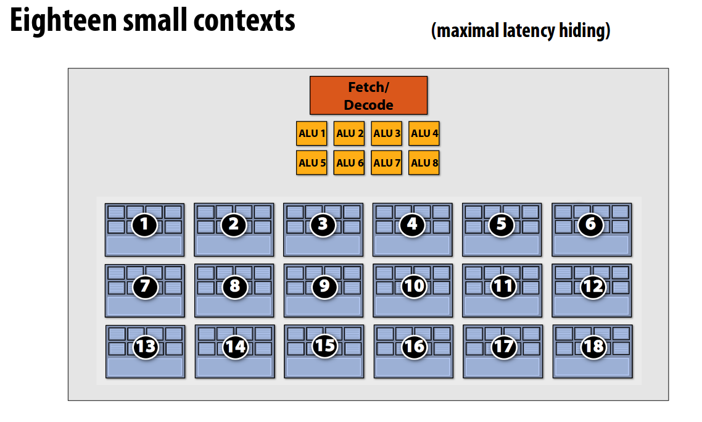
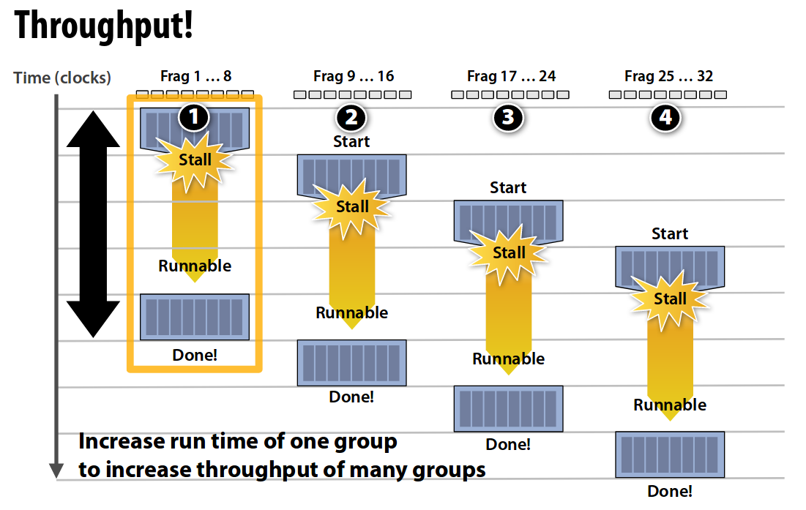
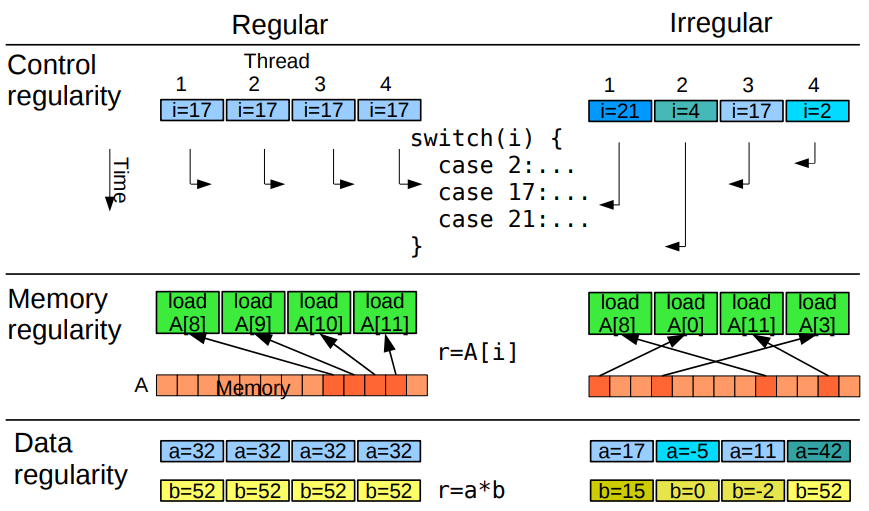
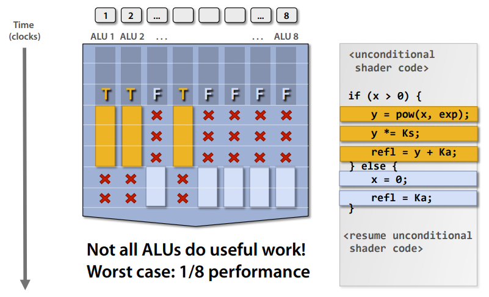
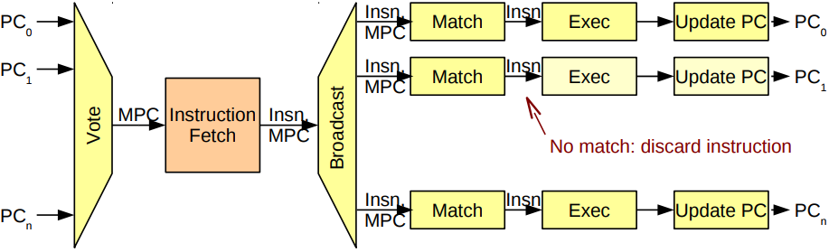
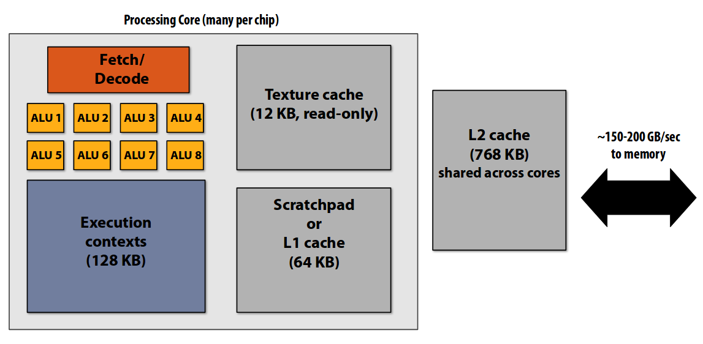

# GPU Architecture

## Background

#### Abstract

Parallel architectures open up possibilities in computing that are infeasible for standard CPUs. While the world of GPU architecture is often esoteric (if not proprietary or otherwise deliberately obfuscated), it is a fascinating and rapidly growing space with varied and powerful applications in modern computation. In this research project, we begin by moving from CPU to GPU architecture, examining the design decisions that drove the architectural differences between the two. We then delve further into vector processing, multithreading, memory access distribution, and other topics specifically relevant to the space of parallel computing. We conclude with some specific examples of constructs in graphics processing that take advantage of the strengths of parallel architecture.


#### Motivation

The Computer Architecture course was organized around designing and implementing CPU components, and eventually, a full CPU. We learned about various techniques for optimizing single-threaded performance, but delving into parallelism and multi-threading was beyond the scope of the class. We suspected that there were some very different design considerations in the space of parallel processors, and that as a result there would be some significant and interesting departures in GPU architecture from those that we studied.

As it turns out, we were right. The space of GPU architecture is massive, and significantly different from anything we studied during the course of the semester. We quickly realized that the material we were discovering was sufficient to populate an entire second course, and decided that the way we could most effectively learn was to focus our project entirely on research. This is the culmination of our work: we didn’t implement anything, but hopefully you can learn something from our collected and summarized research below.


## Research

### Architecture, from CPU to GPU

#### CPUs and Parallelization

In a simple single-threaded processor design, we mostly optimize by minimizing latency. The development of pipelined CPUs and superscalar processor designs made significant headway into this area, using sophisticated branch prediction, out-of-order execution paradigms, large caches and other single-threaded optimizations. These optimizations perform quite well for most tasks, and modern CPUs are incredibly fast as a result, but they are also fairly expensive (in area and bulk of control logic). Unfortunately, even with all of these optimizations, certain very computationally intensive tasks are still unacceptably slow on a single-threaded processor. Graphics processing has long fallen handily into this category.

This problem gave rise to the development of parallelization in processor design. Conceptually, tasks that involve a large amount of computationally independent operations can be broken up and executed on multiple processors. Of course, using multiple expensively latency-optimized processors quickly turns into a very costly endeavor, but as it turns out, we can achieve fairly remarkable results with many much cheaper (slower and smaller) processors. If every operation takes two or three times as long, but we run hundreds of operations in parallel, we trade a marginal increase in latency for enormous gains in throughput.

Effectively, we have a choice between latency-optimized cores and throughput-optimized cores, each of which shines in a different category of tasks. Things like complex conditional logic and branching is best handled in a latency-optimized context, while things like large matrix operations should ideally be throughput-optimized. Eventually, architecture designers started developing hybrid multi-core processors that contained both types of cores and could allocate tasks to each type. These eventually split into two independent dedicated processors: the latency-optimized CPU for most normal operations, and the throughput-optimized GPU for, primarily, graphics.


#### Big Ideas in Computer Graphics

#1 Latency isn't all that bad
Humans' reaction time to visual stimuli is very slow: on the order of hundreds of milliseconds.
Screen clock rates (refresh rates) are on the order of 10-200 Hz. (that's millions and millions of clock cycles we have to play with)

#2 Graphics are data-intensive
Doing multiplications is hard. Doing floating-point multiplications is harder. Doing floating-point matrix multiplication is even harder. We need billions of these per second. High end gaming requires many GFLOPS: Giga-Floating-Point-Operations Per Second
Every pixel requires first 3D geometry math and projection to figure out what it can ‘see’
Every pixel also needs fragment math for colors on textures and pixels and matrix math on 3D and 2D position matrices for lighting.

#3 Graphics processes are mostly independent
Fortunately, projecting onto pixels from a 3D shape and adding texture, color, graphical effects can be done on any 3D point or any pixel at any time: They’re highly independent operations

The inherent parallelism and loose latency constraints allow for data throughput optimizations that drive most of the design decisions in graphics processing.


#### The Shader Core

*For many of these visuals and a lot of conceptual understanding, particular credit to Kayvon Fatahalian and his excellent talk, [From Shader Code to a Teraflop: How Shader Cores Work](http://s08.idav.ucdavis.edu/fatahalian-gpu-architecture.pdf)*



This is a simplified and abstracted model of a CPU. It includes a fetch/decode module for fetching program instructions from memory, an Arithmetic Logic Unit (ALU) to perform mathematical operations, lots of components (like the branch predictor and large data cache) to help optimize single-threaded performance, and an execution context. This is effectively a set of registers in which the current program state can be stored, including any relevant control signals, mathematical operands and calculation results.



We can afford to lose many of these components when working in the paradigm of parallelism. Basically all of the components intended to optimize latency can be dropped; single-threaded speed is much less important than total cost, as any costs will be multiplied over many cores. We are left with a basic CPU that can fetch instructions, execute mathematical operations, and store state.


#### SIMD Processing

Particularly in the context of graphics processing, we’ll often be executing the same instruction over multiple pieces of data. The instruction fetch is a memory operation, and memory operations are very time-expensive; however, we can amortize the cost of the instruction fetch over a batch of mathematical operations. If we can fetch the instruction once, and execute it multiple times, on multiple pieces of data, on multiple ALUs in parallel, we can reduce the cost of the memory operation per piece of data processed.



This concept is called Single Instruction, Multiple Data, or SIMD. Instead of scalar operations on individual registers, a vector processor (with multiple ALUs, as above) can handle vector operations on vectors of registers. The simplest way to accomplish this is to have explicit vector instructions, one of which will be fetched at a time to do multiple operations. Another option is to implicitly vectorize scalar instructions in hardware. Both of these paradigms have seen use in commercial architectures, but implicit vectorization has been shown to offer a lot more flexibility, in exchange for some tricker design tradeoffs.

However, even in the simplest case of SIMD vector instructions, we can already see some of the multiplicatively compounding benefits of these several levels of parallelization.




### Multithreading

#### Interleaving and Execution Contexts

While graphics processing algorithms are optimized to reduce the number of necessary memory accesses, it’s impossible to avoid accessing memory. Our massively parallelizable problem space allows us to hide memory latency and keep arithmetic units (MUL-ADDs) working by interleaving process threads. Interleaving process threads is done by switching to a new instruction with new data to operate on as soon as the current instruction calls for a memory read.

In order to switch to a different thread of execution, the shader core needs to keep track of the state of its execution in multiple different threads. This is implemented with execution contexts, which are complete clones of all of the shader core’s registers. The number of execution contexts corresponds to the number of processes the shader core can switch between. There is a performance vs. area design decision to be made here: more execution contexts are more expensive, but they also allow hiding of deeper memory stalls and higher core utilization.



The process of switching between execution contexts is roughly analogous to the depth of the pipeline in a pipeline CPU, only the execution is not broken up over different hardware units inside the CPU, it’s divided up into time blocks for execution. As most of the execution cycle for a single instruction is taken up by waiting for a memory access, the arithmetic units can be pipelined through the arithmetic-intensive parts of multiple streams of instruction.



Since latency is not a primary concern with GPUs and throughput is the driving factor, this technique allows us to maximize throughput without wasting die space on expensive latency-reducing measures like deep caching.


#### Regularity and Hardware Vectorization

When considering how parallelizable a task may be, two concepts become fairly important:

Regularity: how similar things are to each other
Locality: how close things are together in space or time

More regularity and locality allow for better parallelism, because similar and close together tasks can be consolidated into single vector transactions. An example of this can be found in the simple shader core architecture discussed above: the shared instruction fetch over multiple ALUs.



We can do this “bundling” in hardware to make better use of vector processors. Nvidia calls this Single Instruction, Multiple Threads (SIMT), taking advantage of control flow regularity to consolidate similar threads into “warps” for improved performance.


#### Control Flow Stalls

In SIMD, branching impacts performance in a major way. Because the same instruction must be executed over multiple pieces of data in lockstep, any divergence in control flow necessitates the execution of *every* taken path. The only reasonable solution is to disable the inactive threads whenever a branch is taken.



In addition to these performance costs, it is also non-trivial to implement selective thread enabling in hardware. The simplest method is to use a mask stack. The mask stack is composed of activity masks, which are vectors of bits encoding which threads are active for a given instruction. These vectors are pushed to and popped from a stack of similar masks as different branches (with different active threads) are taken in the control flow. As control flow may be nested to an arbitrary depth, a stack construct is necessary; however, a stack often necessitates yet more expensive memory operations.

Alternately, we can maintain a separate program counter for each thread in parallel. This obviates the need for a mask stack, as the program counters can individually keep track of which instruction they are waiting to execute. However, this makes thread synchronization more difficult: each cycle, a “master” program counter (MPC) must be chosen from the available pool of program counters. Because we still only want to execute a single instruction fetch per cycle per core, a single counter must be chosen to fetch an instruction, which then must be applied only to the relevant threads. There are numerous methods for choosing the MPC (most common, farthest behind, etc) and multiple strategies may be used to optimize execution.



All in all, it is a pretty significant departure from the lockstep, identical-instruction threads of SIMD, and much more like chunks of a normal program running on different threads. This paradigm of more generalized parallel processing is called Single Program, Multiple Data (SPMD), and can be used abstractly to accomplish many types of more heterogeneous execution parallelism, not necessarily limited to a single core or even a single machine.


### Memory

#### Memory Access is Slow

GPU memory systems are designed for high throughput and have a wide memory bus. This is ~6-8 times as fast as a CPU (on the order of a couple hundred GB/s) but still often an order of magnitude less than the mathematical throughput of the GPU (on the order of TB/s).
We have a cache, but it’s smaller and the hierarchy isn’t as deep (and L2 is shared across cores), so it isn’t our main mechanism for absorbing latency.


#### Caching

In GPUs, caching is not nearly as important as it is in CPUs, where branching logic is constantly changing the landscape of what is needed, and latency is costly.

Since there is less branching logic in GPUs, there are fewer opportunities for us to mispredict memory reads and therefore caching can be much more efficiently used and consolidated into few levels. This leads to a very different cache structure than in a CPU, which often has a plurality of cache levels. In GPUs there are usually dedicated texture caches on each shader core, an L1 cache, and then a single L2 cache shared for the entire GPU. The next level is just the raw GDDR5 graphics memory interface. In addition to the predictability of memory access, we’re also allowed to have fewer caches in GPU memory designs because we can use parallel threading to hide memory latency. In CPUs, this is usually left to deeper levels of caching (sometimes up to L4 and L5). It’s important to remember that the primary goal in GPUs is data throughput, and latency is a secondary concern.



The one primary memory operation that happens in almost every GPU shader thread is texture fetching. A texture maps pixel dimensions to color values, and it’s needed for every pixel graphics operation. Shader cores usually have a dedicated texture cache for this. The area cost of the dedicated cache is offset by the temporal and spatial locality of texture accesses in graphics processing. If a texture is on-screen in one frame, it is highly likely to be in the following frames as well, and nearby pixels are also likely to need it. Therefore it can be loaded into many texture caches and used for many frames in a single operation.


#### Memory Access Queue

Because we care more about aggregate throughput performance than the speed of individual instructions, we can employ certain strategies to optimize memory access. GPU memory controllers load pending requests into a queue and use advanced logic to group, reorder, and interleave them. NVIDIA’s variant of this paradigm is called “coalescing,” a process whereby memory accesses from different threads are combined into fewer, larger loads and stores based on spatial locality.


#### Application-level Memory Optimization

Because arithmetic operations are orders of magnitude faster than memory accesses, GPU operations can take advantage of clock cycles by “doing more math” as opposed to fetching more data. Developers can implement this strategy at the hardware level by sharing and reusing data within and between fragments and by computing derived data multiple times rather than storing it. The ratio of mathematical operations to data access in a GPU process is called “arithmetic intensity.” Shader operations typically have a particularly good arithmetic intensity, often with only one memory access per shader operation (usually to fetch a texture). Vertex processing tends to be better than fragment processing in this regard, since it tends to involve fewer textures.


### GPU Output: The Frame Buffer

The frame buffer is a collection of sub buffers, which we will be calling buffers from here onwards.  These buffers are 3D tensors with the dimensions screen width by screen height by bit depth.  These describe some specific aspect of the scene for each final pixel location of the screen.  The frame buffer usually resides in the video memory (GPU RAM).  This memory allows for quick access to the frame buffer which is important for doing a lot of graphics effects.

The Unified shader model allows for buffer information to be computed through the GPU, placed in the buffer, and thrown back into the GPU as the programmer wishes.  They can send information back and forth and do multiple passes over the data allowing for setting up and drawing intricate 2d and 3d scenes.

Conclusive information regarding how much buffers are controlled in hardware vs software was difficult to find, but here is what we found.  The GPU RAM can hold buffers for whatever one designs it too.  The buffers used for this are the extra Color Buffers, but programs can put information into them that do not correspond to color.  However, there are some buffers with explicit hardware operations linked to them in order to speed up computation simply because they are used so often.  These buffers are the Main Color Buffer, Depth Buffer, Stencil Buffer, and Accumulation Buffer.  Additionally, information is only representative of the common design of a GPU, specific designs can have extra hardware accelerated buffers that do other things.

Through the next sections we will go through the noted buffers, and hardware accelerated buffer operations, which we call tests.


#### Main Color Buffer

This is the buffer that actually writes to the screen.  It contains color values that correspond to all of the pixels in RGB or RGBA format.  In a simple scene one would only draw colors onto this buffer directly and then update the screen with it.  It is important to note that no other buffer writes to the screen.

**Scissor Test**
This is a really simple masking step that allows the programmer to cull all fragments outside of the pixel area of a rectangle.  This allows for quick rectangular masking.


#### Other Color Buffer

These buffers are the same as the Main color buffer, except that they do not write to the screen.  These can be useful for saving a rendered picture that will be displayed in the near future on the screen, or really just for any kind of scratch work.

For example, a “normal buffer”, is a buffer that stores the surface normals of objects in terms of color in a scene.  It doesn’t really exist in hardware, but by writing the xyz of the normals of the pixels from the scene, shifting the values so that they correctly range from 0 to 1, then saving it into a color buffer, that color buffer is holding the values of the normals and could easily be thought of as a “normal buffer”. This can be useful for lighting. This is in fact the first step of a process called deferred shading, where geometry is first calculated and a normal map of the scene view is made, then only relevant lighting and shadows are calculated during pixel shading in a second pass through the GPU.

These color buffers can be set to have a programmatic size and thus are simply a 3D array in the Video Memory.

**Alpha Test**
This test allows the user to specify sets of alpha values for which the buffer will cull the pixels.


#### Depth Buffer

The depth buffer is usually 3 bytes or 24 bits deep, and records the distance that each pixel would be in a 3d space from the viewer.  It is super useful for quickly updating a scene where objects are hidden behind other objects in the scene.  This can be used to cull objects based on distance, for example in most 3D games the depth buffer culls objects that are too close to the player in order to make sure that they don’t see the inside of the character model somehow.  The ability to layer objects correctly is an integral part of most graphics applications, and thus the depth buffer has earned itself a spot in hardware with its own accelerated structure that covers most of what a person would reasonably want to do involving depth.

**Depth Test**
This is another rendering operation, one specific to the depth buffer.  This allows the computer to quickly determine what objects should be hidden or not based on depth buffer values.  As each pass of shading attempts to write to the screen, the ones with the lowest depths (closest to us) are saved.


#### Stencil Buffer

This buffer is normally 1 byte or 8 bits deep.  Its function is to mask pixels for drawing to the screen.  It is more flexible than the depth buffer and its corresponding rendering op as it can have in it any kind of calculated or programed stencil, although it has less information, so it can’t be used passed a certain amount of complexity.  One could draw a monochrome shape in photoshop or generate one programatically and load it into the stencil buffer as a mask.  Stencils are great for making sure shaders don’t try too hard to draw things they don’t need too, or saving a particular part of view that will be staying the same for a long while, like the interior of a car in a driving game.  Additionally, stencils can be used to create some interesting world bending effects.

**Stencil Test**
This test is similar to the scissor test, but with a lot more customization.  The layout of this test is as follows.  The stencil buffer is used to generate pass and fail values on the pixels, these are just the relative bits of the selected mask in the stencil buffer.  Then the stencil buffer can do separate operations based on whether the stencil test failed, or passed.  It is important to note that the stencil buffer can be configured where the different bit depths are different masks, but it can also be configured so that the stencil has more than on and off values and comparisons can then be made with greater than and less than operators using the reference and the stencil buffer.


#### Accumulation Buffer

This buffer is a space to blend and collect information from color buffers into one single frame.  It has the same bit depth as a color buffer, however it’s particularly designed to be good for blending and mixing.  The accumulator can add color buffer values to itself or simply load color buffers over itself.  It can additionally add or multiply itself by constants determined by the programmer.  The ability to multiply and add entire buffers efficiently with the accumulation buffer is a real time saver.  Useful for antialiasing, motion blur, blending, depth of field, and other visual effects that require averaging over time and space.


### Example Graphics Operation: Phong Shader

The Phong shader (here we refer to a shader that uses the Blinn-Phong reflection model; “Phong shading” is actually a fragment interpolation technique) is a commonly used computer graphics lighting algorithm. In the aggregate, it takes a 3D surface and approximates the light reflection off of it at vector normals, as a fairly close approximation to surface normals.

```
qsampler mySamp;
Texture2D<float3>    myTex;
float3 ks;
float shinyExp;
float3 lightDir;
float3 viewDir;

float4 phongShader(float3 norm, float2 uv)
{
    float result;
    float3 kd;
    kd = myTex.Sample(mySamp, uv);
    float spec = dot(viewDir, 2 * dot(-­lightDir, norm) * norm + lightDir);
    result = kd * clamp(dot(lightDir, norm), 0.0, 1.0);
    result += ks * exp(spec, shinyExp);    
    return float4(result, 1.0);
}
```

As mentioned above, this is an example of shaders having a high arithmetic intensity; the only memory access takes place on the third line to sample a texture, while the rest consists of only floating point operations.
This shader runs in parallel over each of the vertices of a surface or scene. It calculates the reflection off of the surface in two parts: first the intensity of the direct reflection into the camera from the smooth part of the surface (specular reflection), which creates realistic highlights, and also the more evenly spread and less intense reflection from duller material (diffuse reflection). These are scaled based on their respective coefficients, the specular one constant and the diffuse one determined by the texture sample at a particular vertex.


## Resources

A particular credit is in order to Kayvon Fatahalian, Assistant Professor of Computer Science at Stanford University, for his readily available lectures and papers on computer graphics. His website can be found [here](http://graphics.stanford.edu/~kayvonf/).

http://s08.idav.ucdavis.edu/fatahalian-gpu-architecture.pdf
**Useful**, This is much like that other powerpoint, however it has more text at the end and was much more understandable to me.

http://www.haifux.org/lectures/267/Introduction-to-GPUs.pdf
**Slightly More Useful**, This is an extension of the above link.  This talks about what the above does and more.

https://www.irisa.fr/alf/downloads/collange/talks/ufmg_scollange.pdf
**Super Useful**, Great looking presentation on the setup for parallelism in GPUs.  However, this source focuses on SIMT processors rather than SIMD processors.  SIMT are much more hardware heavy in that at runtime all the instructions are parallelized, therefore it’s dynamic and more flexible.  Whereas SIMD is parallelized at compilation, thus, it is more static but probably easier to think about and implement.

https://wccftech.com/amd-radeon-r9-290-hawaii-gpu-block-diagram-pictured-detailed/
Interesting look at an AMD architecture doing asynchronous computing (confusing)

https://www.youtube.com/watch?v=JFhG9UntZs4
Short video discussing what a CUDA is.  (TL;DR: It’s the same as a stream processor, it is essentially the total number of SIMD functional units inside the GPU, these are normally described by how many there are per shader core and then how many shader cores they are, but NVIDIA likes to just put a big number on how many there are in total.)

http://graphics.stanford.edu/courses/cs448a-01-fall/
**Maybe Useful**, Real Time Graphics at Stanford.  This is a class on Real Time graphics, can’t yet tell if it is about GPU design or coding, either way it has stuff for both. *The explored GPUs look pretty old.*

http://www.glprogramming.com/red/chapter10.html
**Solidly Useful**,  This is a chapter from an openGL tutorials book explaining frame buffers.  In general this is probably useful to look into.

http://www.google.nl/patents/US8081182
**Pretty Useful**, Patent about someone’s particular approach to implementing the depth buffer with rasterization or something.  It’s not really important, but they do give a nice 5-6 short paragraph explanation for the common graphics pipeline and the steps, focusing more on the frame buffers part rather than the vertex and fragement processing parts we have been focused on.

http://download.nvidia.com/developer/presentations/2005/I3D/I3D_05_IntroductionToGPU.pdf
**SUPER USEFUL**, Slide Deck talking about hardware gpu stuff.  Slide 18 is a particularly nice graphic for showing the frame buffer.
http://www.cs.cmu.edu/afs/cs.cmu.edu/academic/class/15869-f11/www/lectures/08_mem_hierarchy.pdf
**Probably Useful**, Memory Hierarchy lecture by Fatahalian

http://meseec.ce.rit.edu/551-projects/spring2015/3-2.pdf
**Probably Useful**, Has nice graphical and specific explanations for how the GPU Hierarchy looks.
