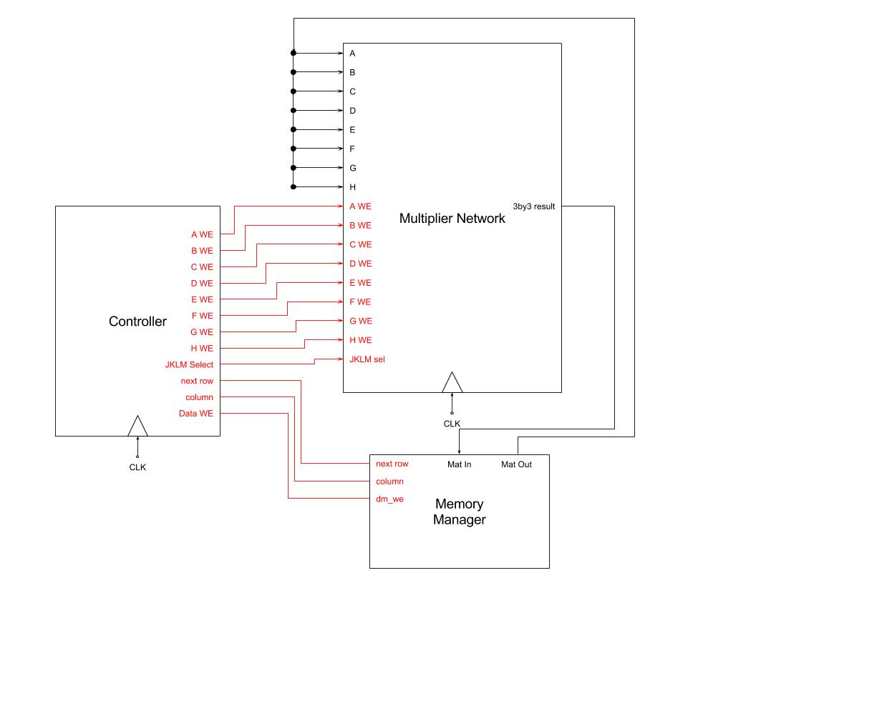
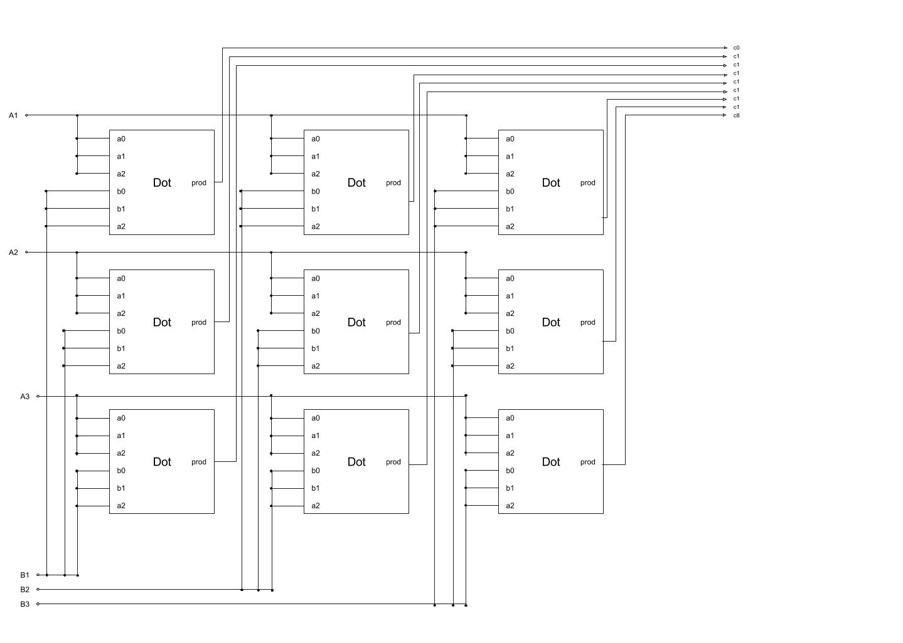
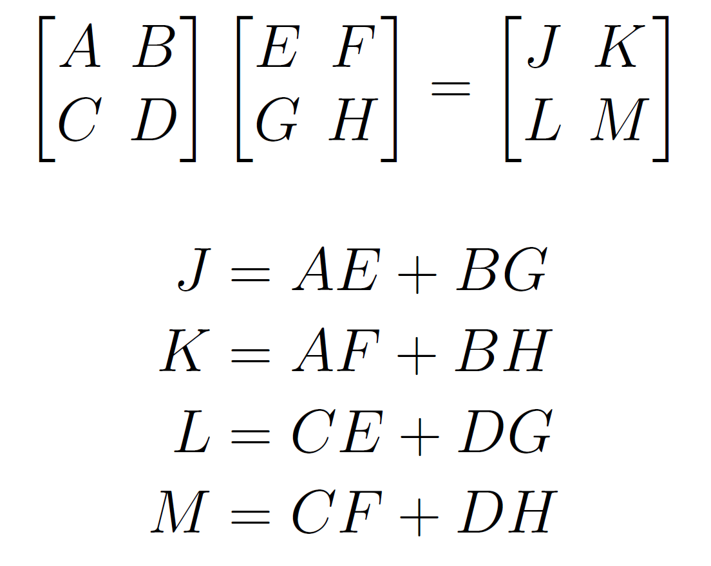
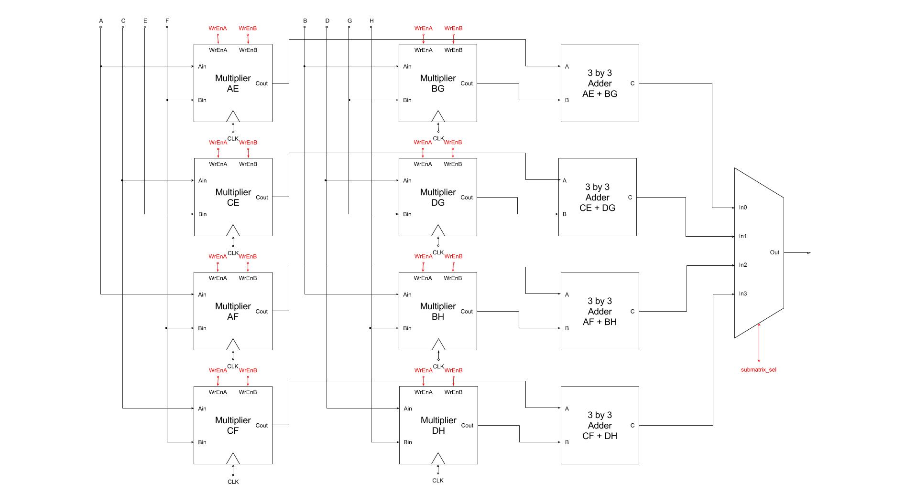
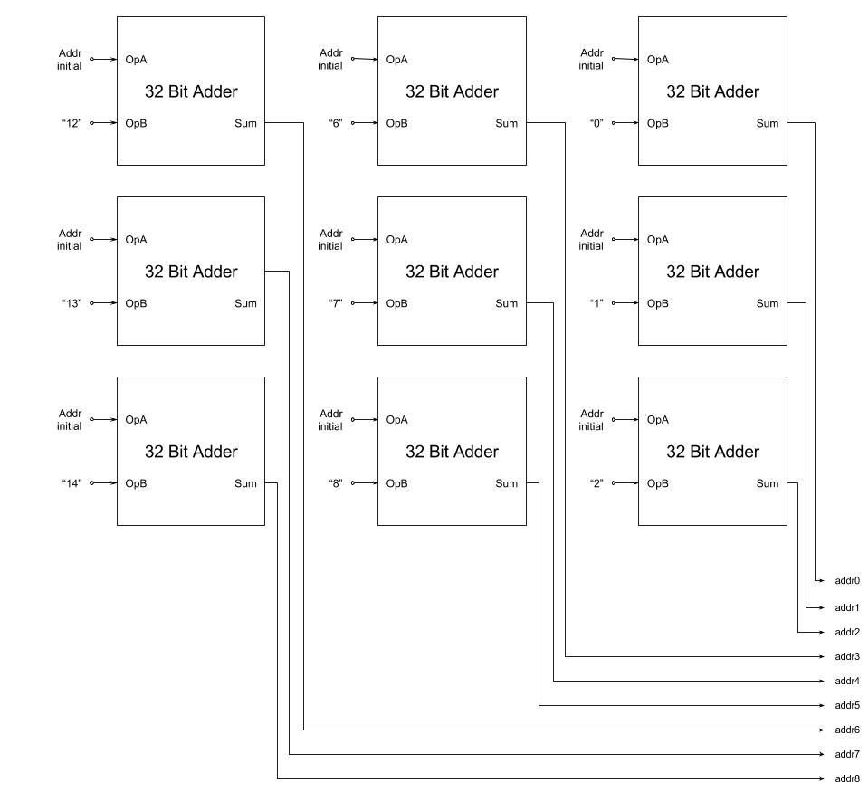
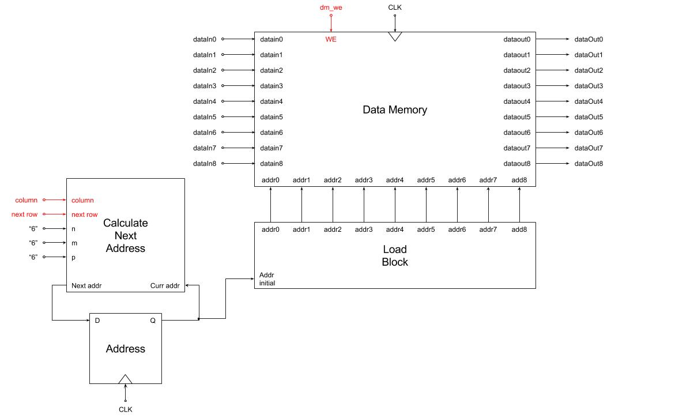
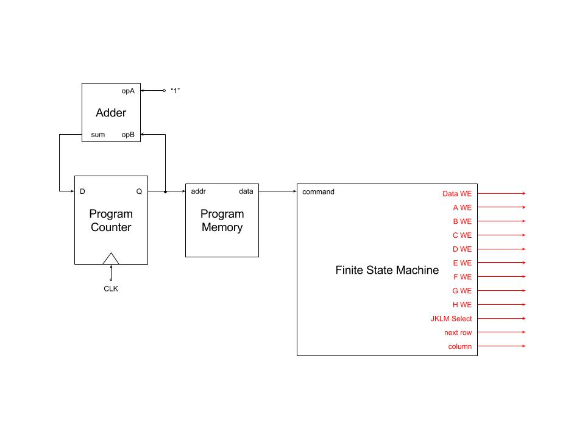

---
---

# Matrix Multiplication

## Abstract

We designed computer hardware to optimize multiplying two 6x6 matrices. Matrix multiplication is a complex and time intensive operation for normal computer architectures because there are a large number of individual computations; however, it is used frequently for machine learning and computer graphics. Because each value in the result matrix can be computed independently from any other result, matrix multiplication is an excellent candidate for parallelization. We wanted to explore the potential efficiency gain from using a purpose built matrix multiplier, and see how to split a workload among a large number of computing units.

## Project Motivation and Background

After studying single cycle MIPS CPUs, we were interested in other computing architectures with different strengths and weaknesses. We first looked at GPUs, which were originally designed specifically for graphics, but have recently been generalized to have all the functionality of CPUs. Graphics operations are essentially a subset of matrix operations (where the :With this added functionality, GPUs have become increasingly useful for machine learning algorithms and general parallel computing. In particular, computations on matrices are complex and time intensive on normal CPUs, but the extreme parallelization of computations in a GPU makes these operations much more efficient. We wanted to explore this increase in efficiency by making some purpose built hardware for matrix multiplication.

## How to use

We made custom architecture that can multiply two 6x6 arrays of 5 bit unsigned integers (or smaller arrays, if you pad the rest of the matrices with zeros). 

To run the program, clone the [repository](https://github.com/poosomooso/FinalProject), run the command `chmod 755 ./6by6multiply` and then run `./6by6multiply.sh`.If you wish to try different matrices, you can change the matrices in`setup_memory.py`. 

## Implementation

**Figure 1** : High level block diagram of the system (components explained below).

**Figure 2** : Our core multiplier - multiplies two 3x3 matrices. The core multiplier contains a matrix multiplication module and a collection of registers to store the matrices. A and B are the input matrices, and C is the result.

The heart of our algorithm is the matrix multiplication unit, or the multiplier. It takes two 3x3 matrices and multiplies them. It consists of 9 dot product modules that dot product vectors of length 3. The dot products happen in parallel. The multiplier also contains a small collection of registers that temporarily store the input and output matrices until other modules use the result.

**Figure 3** : the algorithm we use to multiply the 6x6 matrix, where each capital letter represents the 3x3 section of the matrix.

Each 6x6 matrix is broken down into 4 3x3 matrices. The figure above shows the algorithm we use to multiply the broken up matrices, where each 3x3 matrix is represented with a capital letter. We are basically breaking up the dot products of each row and column vector into 3x3 chunks, and adding them together. This is a simplified version of the [divide and conquer algorithm](https://en.wikipedia.org/wiki/Matrix_multiplication_algorithm#Divide_and_conquer_algorithm), which is preferred over performing each dot product, generally because of caching (though not relevant in our case). In our case, we preferred it because it allowed us to have constant size multiplication blocks (the aforementioned 3x3 matrix multiplication unit), so we didn’t have to make variable size dot product modules. Although we currently constrained ourselves to 6x6 matrices, using the 3x3 modules allows us to scale in the future.

**Figure 4** : The multiplier network that parallelizes the 8 dot products and 4 additions necessary to multiply the 6x6 matrix.

The algorithm is performed and parallelized in the multiplier network. The multiplier network contains 8 multipliers, one for each pair of broken up matrices that need to be multiplied. It also contains four 3x3 matrix adders. Each 3x3 matrix in the result matrix of the above figure uses 2 of these multipliers and one matrix adder, so all of the resultant 3x3 matrices are calculated independent of each other.

 

**Figure 5** : The matrix manager that handles the main memory and breaks down the matrices. The top is the load block module which generates the addresses for the 3x3 block in memory. The bottom is the full matrix manager, which uses the load block, data memory, and an address register. It also has a block for determining the next address, which is mostly muxes and arithmetic.

We use the matrix manager to break down the matrices and populate the multiplier network correctly. The matrix manager manages loads and stores to data memory. It also computes and keeps track of the index of the first element of the 3x3 arrays, and uses a load block module to retrieve the 3x3 array starting from the computed starting index. The output from the matrix manager goes to the network of multipliers. The output from the multiplier network is fed back into the matrix manager to store into memory. We store the matrices as a vector in data memory, as follows:

|3 by 3 Matrix | Data Memory |
| --------- | -------- |
|a11 / a12 / a13 | a11 |
|a21 / a22 / a23 | a12 |
|a31 / a32 / a33 | a13 |
| | a21 |
| | a22 |
| | a23 |
| | a31 |
| | a32 |
| | a33 |

These matrices are stored sequentially in memory, and the resultant matrix is stored directly following the second matrix in memory.

**Figure 6** : The module generating the control signals, backed by an FSM that generates signals based on a series of instructions.

Finally we have the controller. The controller reads in commands from a file and writes them to the FSM. The FSM breaks down the command into two sections: the *type*, which is either ‘00’ for loading a matrix, or ‘01’ for saving a matrix, and the *block*, which represents a particular 3x3 matrix:

| Matrix | Block Code |
| --- | --- |
| A | 000 |
| B | 001 |
| C | 010 |
| D | 011 |
| E | 100 |
| F | 101 |
| G | 110 |
| H | 111 |
| J | X00 |
| K | X01 |
| L | X10 |
| M | X11 |

We can generate all the control signals through these two codes. We use *type* to tell us whether we are working with input matrices or the resultant matrix. From the two input matrices, we can tell which one we are using by looking at the MSB of *block*. And we can tell when we need to move to the next row of 3x3 matrices by looking at the LSB of *block* — all the blocks on the left side of the matrix have a 0 in the LSB, and all the blocks on the right side of the matrix have a one in the LSB. 

That last trick only works because we are dealing with 6x6 matrices, so they get broken down into 2x2 (i.e. binary) squares. If we were to scale the size of the matrices, we would have to come up with a new way of detecting when to go to the next row of 3x3 matrices. 

We use a Python script to generate the program memory and the initial data memory. The Python script has two numpy arrays hardcoded, that can be changed at any time. It then  converts the numpy arrays to be binary encoded, and writes the array to a file.It also writes the program memory to a file, which for the 6x6 multiplier, should be the same every time, since the instructions are only dependent on the size of the matrix.

## Reflection

While being constrained to only a 6x6 matrix falls a bit short of our goals, we did not anticipate how complicated it would be to design all the small modules in the design and wire them up together properly. However, we did stay on track with our workplan and reach a version of our planned goal. Our workplan was intentionally vague, since at the beginning of the project, we knew there were a  lot of options to explore, and we didn’t know how this project would manifest. Overall, we learned a lot about implementing matrix multiplication, and techniques for parallelizing.

One thing that we hoped to implement, but was not able due to time, was full parallelization of loading data. Currently, our matrix manager only loads one 3x3x matrix at a time, but the multiplier could be much more efficient if it could load all the matrices to the multipliers at the same time, and then write back all the results at the same time. A lot of our architecture that we built in the beginning (data memory, load block) assumed we would only be loading 9 entries at a time, since each multiplier unit was using 9 entries of each particular matrix. However, it wasn’t until later that we realized that our design would be much more efficient if we could load multiple 3x3 blocks at once. By then, so much of our design depended on individually loading these 9-entry blocks that it was difficult to go back and retroactively make changes. If we did this again, we would spend a little more time in the beginning, working on block diagrams.

## Future Extensions

I think the next logical step is to scale this up, where each dimension is an arbitrary multiple of 3. Then, multiplying matrices of any size, by padding the matrix with zeros until the dimensions become a multiple of 3.

Another extension is to apply the matrix algorithm to actual science or graphics applications, and make customized hardware for a specific application.

<!-- ## Appendix -->

