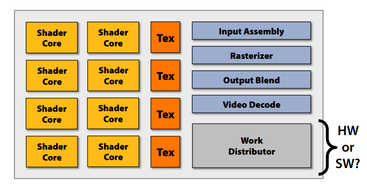
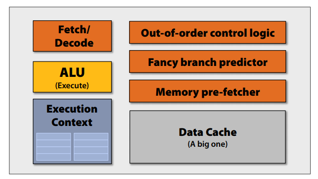
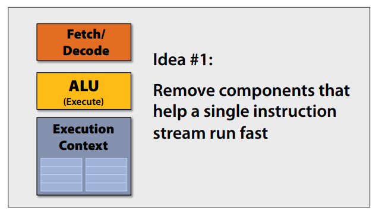
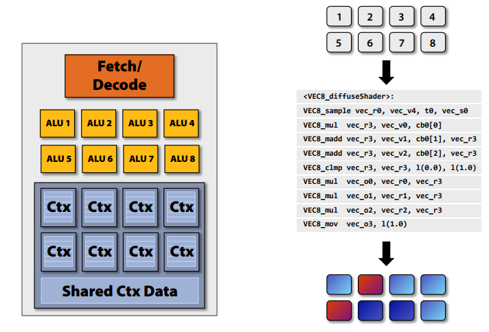
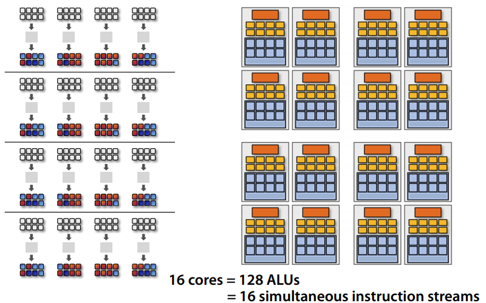
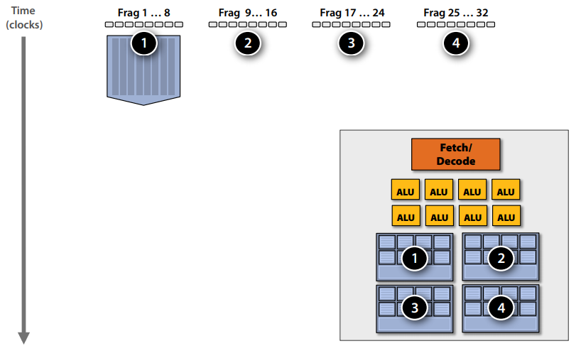
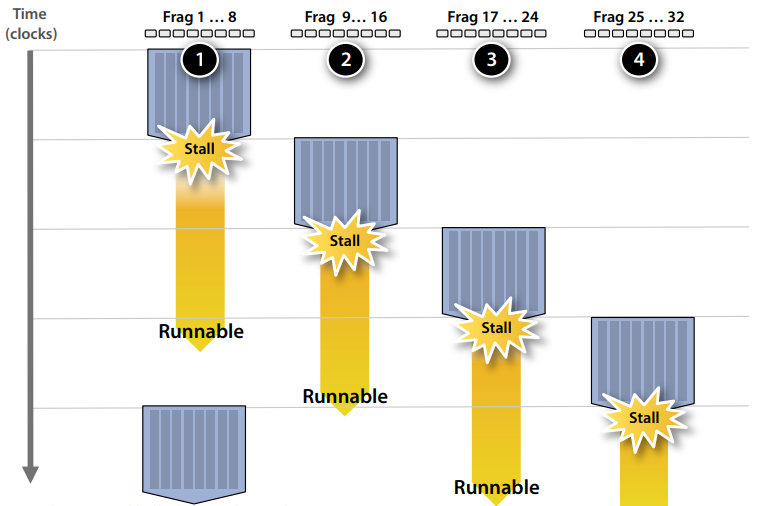
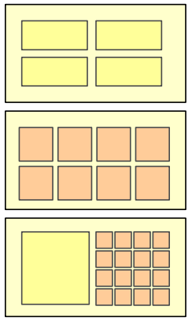

## SigGraph 2008 Talk

#### Overall architecture

Each shader core is like a smaller, specialized CPU. You don't need to optimize for single-thread efficiency, so you can remove a lot of specialized hardware from a CPU design.

Of these components:

- fetch/decode is pretty much analogous to the same unit in a CPU
- In this example, there's a single ALU, but actual GPU architectures can include many ALUs (usually specialized for vector operations)
- Execution context is a set of registers to store the current state in, to do effective multiplexing with high-latency stuff: more below

#### SIMD Processing

You can amortize the cost of managing a single instruction stream over multiple ALUs, since many "fragments" will need to be processed with the same set of instructions. Instead of scalar operations on scalar registers, you can do vector operations on vectors of registers. This is called SIMD (Single Instruction, Multiple Data) processing. You can either have explicit SIMD vector instructions, or write scalar instructions that get implicitly vectorized in hardware. This is a design decision, and different architectures do it differently.

In this example, each ALU unit has its own single block of context data.

Now, you can do a lot of processing in parallel. With 16 cores, 8 ALUs per core, you can process 16 simultaneous instruction streams on 128 (total) fragments at the same time.

Branching is kind of gross, though. Because you're processing several fragments through the same set of instructions, you have to take *every* branch that *any* of your fragments take. On the plus (?) side, this kind of obviates the benefits of a specialized branch predictor unit, as you'd rarely make use of it to skip anything.

#### Stalls and Latency

Here's where the execution context becomes really helpful. For certain operations, like retrieving a texture from memory, there's a massive amount of latency during which time your core would be doing basically nothing. If you instead build in multiple complete sets of execution contexts:

While you're waiting for a stall to finish, you can store the current state in a context and switch over to another set of fragments for processing. This allows you to minimize the effect of high-latency operations on throughput.

## UFMG - Architecture and micro-architecture of GPUs

Before 2000, the focus was on improving single-threaded performance (reducing latency). Pipelining in the 80s, superscalar processors using branch prediction, out-of-order execution, other tricks to improve performance in the 90s. Regularity in application behavior allows for predictions to pay out on average.

After 2000:

#### Multi-Threading
- Homogeneous multi-core
  - Replication of the complete execution engine
  - More cores, more parallel work
- Interleaved multi-threading
  - Uh. Basically pipelining?
- Clustered multi-threading
  - For each unit of data, select between above

#### Heterogeneity
- Latency-optimized multi-core: spends too much resources on parallel portions
- Throughput-optimized multi-core: not performant in sequential portions
- Heterogeneous multi-core: contains both types, can specialize

