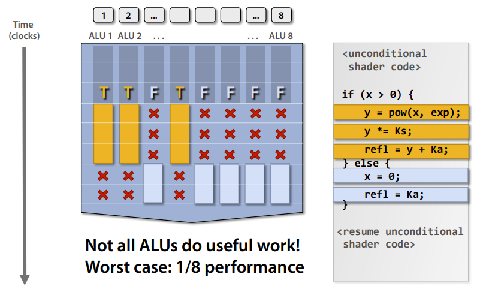
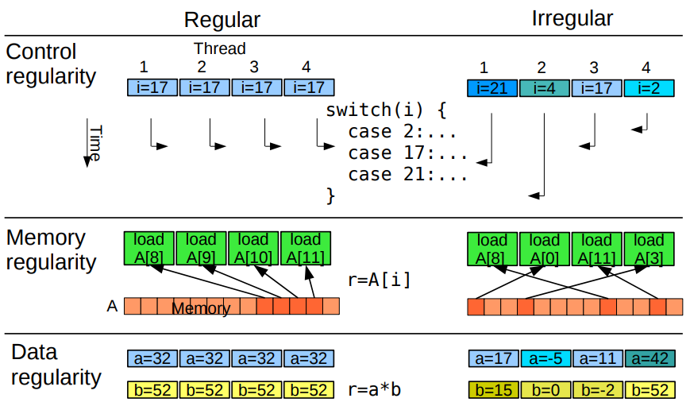
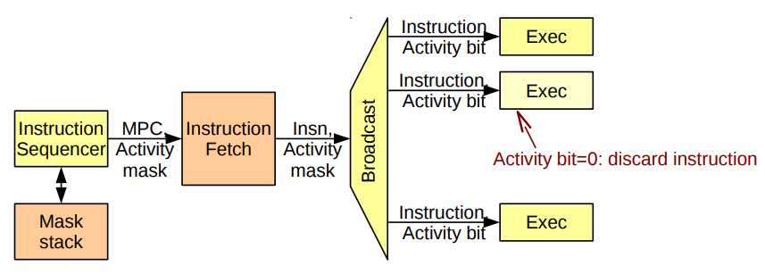

## SigGraph 2008 Talk

#### Overall architecture

Each shader core is like a smaller, specialized CPU. You don't need to optimize for single-thread efficiency, so you can remove a lot of specialized hardware from a CPU design.

Of these components:

- fetch/decode is pretty much analogous to the same unit in a CPU
- In this example, there's a single ALU, but actual GPU architectures can include many ALUs (usually specialized for vector operations)
- Execution context is a set of registers to store the current state in, to do effective multiplexing with high-latency stuff: more below

#### SIMD Processing

You can amortize the cost of managing a single instruction stream over multiple ALUs, since many "fragments" will need to be processed with the same set of instructions. Instead of scalar operations on scalar registers, you can do vector operations on vectors of registers. This is called SIMD (Single Instruction, Multiple Data) processing. You can either have explicit SIMD vector instructions, or write scalar instructions that get implicitly vectorized in hardware. This is a design decision, and different architectures do it differently.

In this example, each ALU unit has its own single block of context data.

Now, you can do a lot of processing in parallel. With 16 cores, 8 ALUs per core, you can process 16 simultaneous instruction streams on 128 (total) fragments at the same time.

Branching is kind of gross, though. Because you're processing several fragments through the same set of instructions, you have to take *every* branch that *any* of your fragments take. On the plus (?) side, this kind of obviates the benefits of a specialized branch predictor unit, as you'd rarely make use of it to skip anything.

#### Stalls and Latency

Here's where the execution context becomes really helpful. For certain operations, like retrieving a texture from memory, there's a massive amount of latency during which time your core would be doing basically nothing. If you instead build in multiple complete sets of execution contexts:

While you're waiting for a stall to finish, you can store the current state in a context and switch over to another set of fragments for processing. This allows you to minimize the effect of high-latency operations on throughput.

## UFMG - Architecture and micro-architecture of GPUs

Before 2000, the focus was on improving single-threaded performance (reducing latency). Pipelining in the 80s, superscalar processors using branch prediction, out-of-order execution, other tricks to improve performance in the 90s. Regularity in application behavior allows for predictions to pay out on average.

After 2000:

#### Multi-Threading
- Homogeneous multi-core
  - Replication of the complete execution engine
  - More cores, more parallel work
- Interleaved multi-threading
  - Uh. Basically pipelining?
- Clustered multi-threading
  - For each unit of data, select between above

#### Heterogeneity
- Latency-optimized multi-core: spends too much resources on parallel portions
- Throughput-optimized multi-core: not performant in sequential portions
- Heterogeneous multi-core: contains both types, can specialize

#### Regularity in threading

Regularity (similarity in behavior between threads) allows for greater parallelism: time-intensive tasks like memory access across multiple threads can be consolidated into a single transaction. This cooperative sharing of fetch/decode and load/store units improves area/power efficiency (Nvidia calls this SIMT, in which threads are consolidated into "warps" for improved performance).

#### Control Divergence

Traditionally, in SIMD processing:

- One thread per processing element
- All elements execute the same instruction
- Elements can be individually disabled

This is basically the structure covered in the SigGraph talk. Performance takes a larger hit the more branches taken, because every branch is taken.

This is accomplished through the use of a mask stack or activity counters; a bit per thread shows which are currently active, or a counter per thread counts up for each active instruction cycle.

Alternately, you can maintain a separate program counter per thread. This has performance benefits, but makes thread synchronization a non-trivial task. Now you need to figure out which PC to use as the "master" PC each cycle, since you still only want to do one consolidated instruction fetch operation. This can be determined via various criteria (most common, latest, deepest function call nesting level, some combination) to maximize efficiency.

This starts looking a lot less like SIMD and a lot more like normal programs. There's no enforced lockstep of vector instructions; it's basically just different cores doing different things in parallel. You also don't need to maintain a stack of activation bits, which is nice.

This general paradigm is called SPMD (Single Program, Multiple Data). It's an idea that can be used for more than just specialized vector processors, and can also refer to parallel computation being done via message passing (e.g. MPI) over multiple independent computers, which allows for more flexibility in instruction fetches as well.
