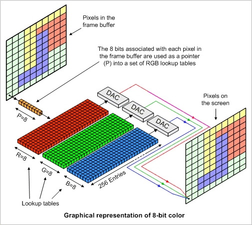
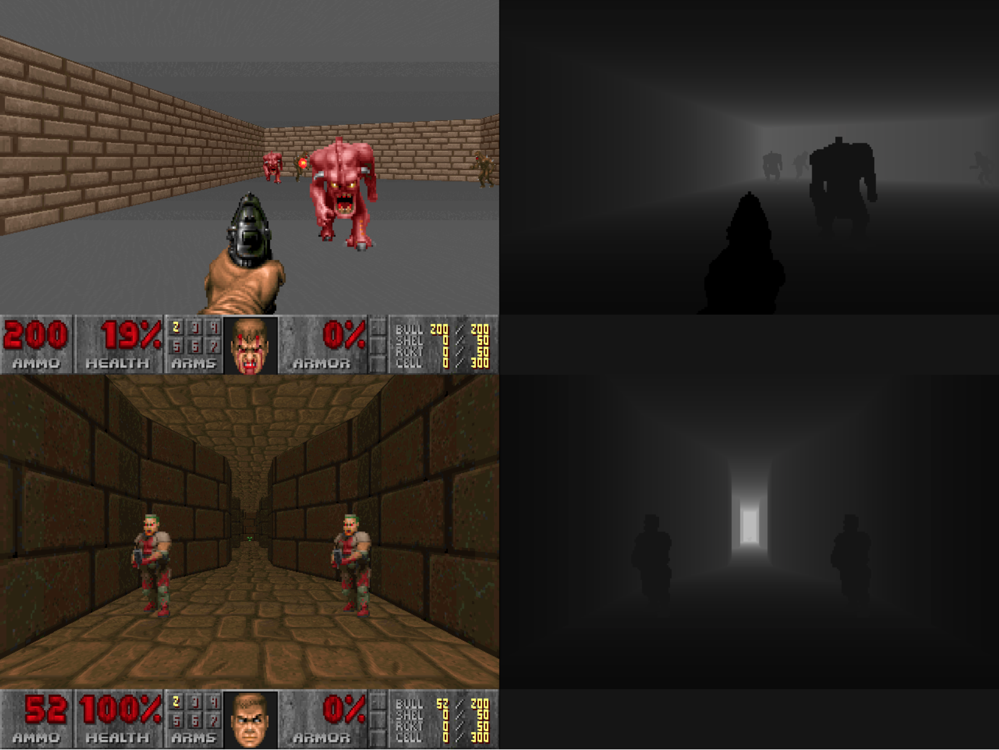
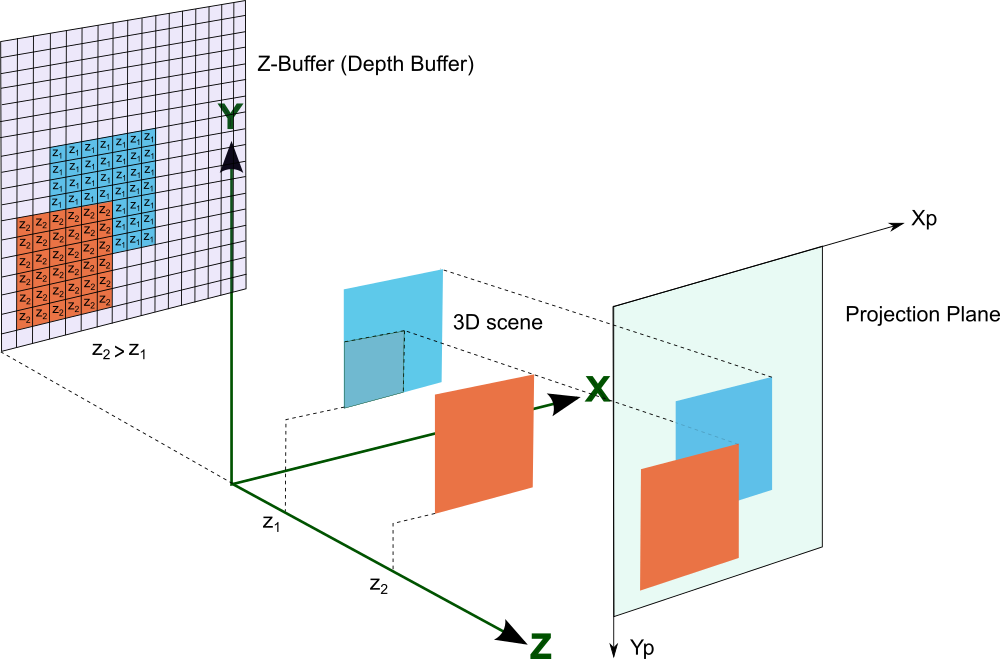
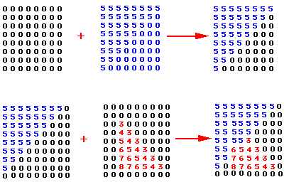
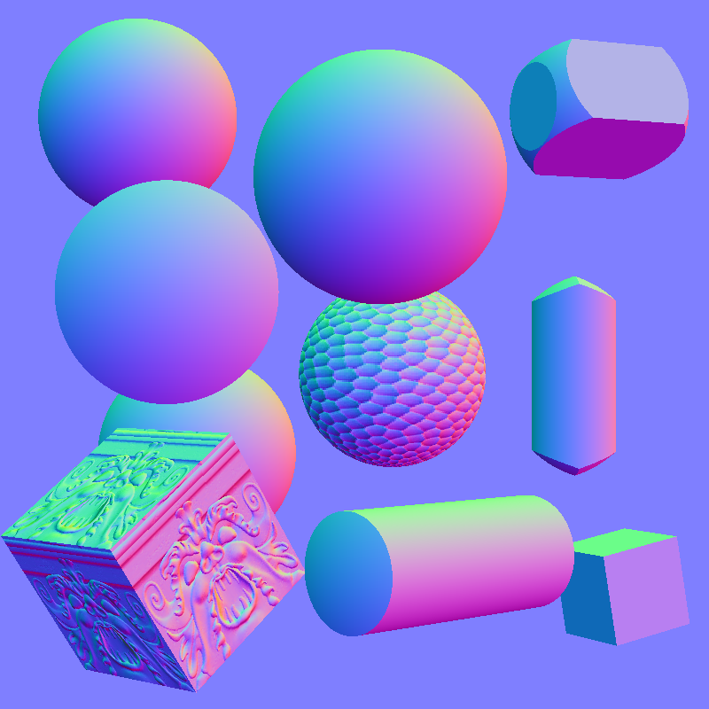

# Frame Buffer

The frame buffer is a set of sub buffers that are used to determine what exactly ends up on the screen.

The frame buffer breaks down into Color Buffers, a Depth buffer, a Stencil buffer, and an Accumulation buffer.  (There are technically some others too, but they aren't super as important as these ones I think.)

###### Frame Buffer Visual

This is a simplified picture of what the frame buffer is.  It simply saves all the computed information that will then be written to the screen.  Before writing it, it is fragments with computed information from the fragment shaders, then it is written to the screen and becomes pixels.  (In this example picture we are looking at a 24 bit color buffer, which will be explained in a sec.)

##### What is a buffer?
It is a matrix of values in memory that correspond to the pixels on the screen.  These values also have a particular bit depth based on what the buffer is and how the programmer wishes to use it.  For example, one could use a 1 bit depth color buffer to represent only black and white on a screen.  An important thing to remember about these buffers is that their main purpose is to save data that would be useful later.  All of these buffers generally keep and maintain data from previous computation unless explicitly cleared.

**Tentative Note:**

It appears that all of these buffers other than the main color buffer, are things that you can set your self.  Many graphics programs use most of them simply because they are so integral to being able to do graphics, however, one could make buffers for whatever information they want and use them in calculations.  All of these buffers are stored in the graphics hardware's random access memory (RAM), and are designated, not explicitly in the hardware, but by the programmer.

###### (Not Sure if this is correct)

## Main Color Buffer
The main color buffer is what determines the pixels for the scene you plan to draw. Without any extra buffers active, this buffer is what the math in the shader cores determines.  The pixel are all updated based on this.  These usually have a bit depth of 24 bits for true color pixels (2^8 for R G and B) on the screen, sometimes just 16 bits (2^5 for two colors and 2^6 for the last, which is usually green) for less specific colors, and technically they can have fewer bits.  An alpha channel can also be added to do 32 bits.  The picture in the Frame Buffer section is an example of a color buffer.

IMPORTANT NOTE: This is the only thing that ends up actually getting drawn to the screen, the rest of the buffers are used to edit this buffer.

##### Extra Color Buffers
There can be extra color buffers depending on the gpu setup.  These allow for saving images that the programmer may know are going to be used for a while.  They work the same as the main color buffer and are not written to the screen by default, only if the programmer specifies.

## Depth Buffer (or Z-Buffer)
The depth buffer is a representation of how far away the pixels on the screen are from the viewer if the scene existed in 3D space. This is useful for determining if an object that moves goes in front of or behind another object.  These are usually 3 bytes (24 bits) deep.

###### Doom Depth Buffer Example

In this example the actual game is on the left and the depth buffer values are displayed on the right (black being closer to the player, and white being further).  These values allow the game to correctly display what is in front of what and not have graphics in the background lay on top of those in the foreground.

Another example, imagine a screen consists of a 2d House and a car driving by behind said house.  The depth values for the area taken up by the house would be lower (closer) than those taken up by the car.  Every time the screen is updated the car's depth values and color values would move towards the house. Once they overlap, the depth buffer would determine that the colors of the car are in fact behind those of the house, and thus the car is not displayed on the screen where it overlaps with the house.  This process is called a depth test.

###### Depth Test Visuals

The programmer can also manually change information about what is happening in the scene by manually changing depth values for objects.

For example, imagine an application that allows you to punch holes in your browser through which you can see your desktop.  The browser is essentially just a rectangle with a higher depth value than your desktop background.  In order to punch a hole in it, one could just define a punch shape that the GPU can process and determine the pixel locations for, and then write the minimum distance on the depth buffer for the fragments inside this shape corresponding to the desktop background.  Thus the desktop shape there would punch through and appear on top of the browser.

## Stencil Buffer
This is a buffer that is normally 1 byte (8 bits) deep and simply designates whether to update the corresponding pixels.  Each bit in the buffer essentially acts as a mask, thus the 8 bits allow for 8 masks over the screen to stop certain color buffers from being rendered onto the screen in certain places.  This is similar to how a graffiti artist would graffiti a multi colored graffiti.  In fact that is where the name comes from.  This is kinda like the depth buffer in that it can hide parts or entire objects, however this is particularly manual in that the programmer defines the shapes that are draw zones or no draw zones.

###### Antichamber Stencil Buffer Example
https://youtu.be/V9HvgmNVQGM?t=8m33s

Short clip from antichamber, great example of stencil buffers.

In this example there are small cube areas where different geometric objects exist, however the game uses stencil buffers to overlay different scenes in what should be the same geometric area.  The way this most likely works, is the shader code of the game give each of those different areas its own stencil mask and then renders the seen objects in each of those scenes.  In fact to go further and optimize, the game probably only has four separate scenes that are loaded each containing all the objects on one face side, this way one would only need 4 masks in order to correctly show the objects in the game.  The only problem with all this is there is a lot of extra math and calculations that happen before the objects that aren't supposed to be seen are culled due to GPUs being bad at conditional logic.  I'm pretty sure the setup is that the objects that are seen in any way are entirely rendered, and then afterwords multiplied by the cull mask, therefore a lot of extra math is happening.  This isn't super evident when this youtuber plays the game, but when I run the game on my computer as soon as I walk into this room the game starts to slow down quite noticeably.

## Accumulation Buffer
The accumulation buffer is a sort of workspace for more complex graphics operations.  This buffer uses values from one or more color buffers to generate things like antialiasing, motion blur, and blending.  Once the buffer is done accumulating from the other buffers it then writes back to the main color buffer.  This can be thought of something like how a photographer can blur together images by taking multiple pictures of a scene without advancing the film of the camera.  This creates blur for things that move, or if done correctly translucent looking objects in an image, although the computer has the capacity to do more complicated tasks.

###### Motion Blur Accumulation Buffer Example
https://youtu.be/6zhTNYY8ehM?t=13s

## Normal Buffer

Normals are simply the direction vector perpendicular to a surface.

This buffer essentially just records the normals of the fragments in the scene.  These can then be used to calculate lighting with information about where the light is and object color or texture.  Additionally, for more realistic light one can use the material, like smoothness, reflectivity, and whether the light on it is colored.

###### Visualization of the normal buffer

In the example, you can see that the normals of the object denoted with RGB values.  Green points towards positive y (up), Red points towards positive x (right), and blue points towards positive z (towards camera).  This is why everything in the middle is generally blue, and all the values have a blueish tint, because we are looking from the positive z direction.  Additionally, the direction upwards between these three axis is generally grey, this is most apparent on the upper right object with the whitish plane.  The colors on the back of the sphere would be similar to those on the front but without much blue, and those there would be a dark spot on the back side.

This buffer isn't as explicitly important as the other buffers, because depending on your shader program one might calculate the normals as they go and not store them all in a buffer.  Thus, as stated in the beginning, these buffers are useful tools controlled by the programmer, but not explicitly defined through hardware.  At least usually, maybe in some designs since some of these are so common there is actually explicit hardware for it.

## Clearing Buffers
It’s also super important to clear the buffers when needed, if not then some weird visuals can happen.  For example, while I’m not sure if this is why it happens, one could imagine that if you don’t clear the color or depth buffers, one would get a scene that appears to leave a trail of moving objects.  For example, I’m sure some of y'all have experienced when you move your browser and the computer updates it’s position but doesn’t clear its old position, leaving a trail of browser on your screen.

# Resources

OpenGL book explanation on frame buffers can be found [here](http://www.glprogramming.com/red/chapter10.html).
